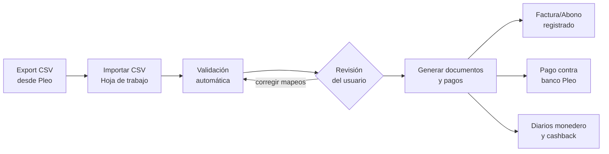
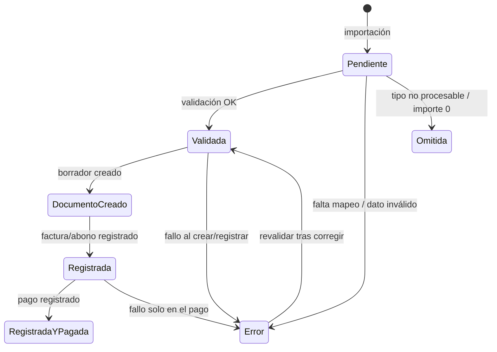
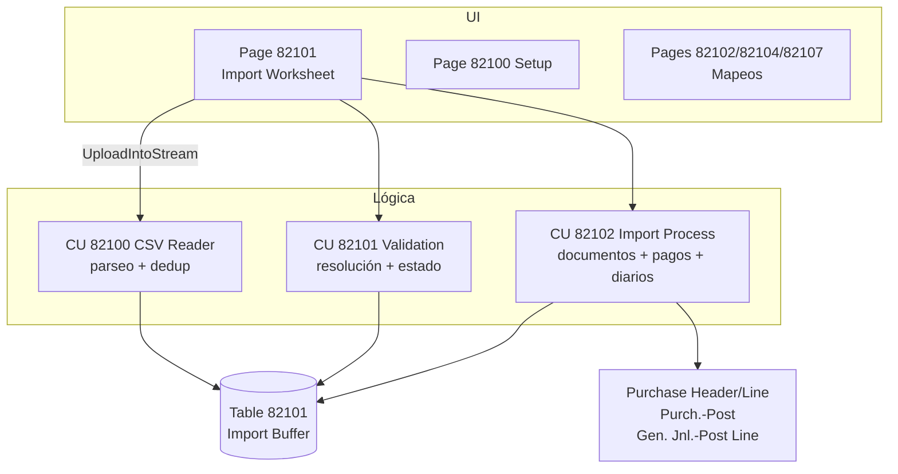

# Importación de Facturas de Pleo — Diseño Funcional y Técnico

| | |
|---|---|
| **Módulo** | Importación Pleo (app *Neelo Core Solutions by BeDynamic*; código en `src/` por tipo de objeto) |
| **Rango de objetos** | 82100 – 82107 |
| **Namespace** | `BeDynamic.PleoImport` |
| **Fecha del documento** | 15/07/2026 · actualizado 22/09/2026 |

---

## 1. Objetivo

Automatizar la contabilización en Business Central de los gastos pagados con tarjetas [Pleo](https://www.pleo.io/). A partir del CSV que exporta Pleo, el módulo:

1. Carga los movimientos en una hoja de trabajo (staging) con validación automática.
2. Genera por cada compra una **factura de compra** (o abono si es devolución) con IVA incluido.
3. Según la configuración, la **registra** y genera el **pago** contra un banco puente que representa el monedero de Pleo.
4. Opcionalmente contabiliza también las **recargas del monedero** y los **cashbacks** mediante diarios.
5. Soporta gastos **CAPEX**: en lugar de ir a una cuenta de gasto, la compra se carga como coste de adquisición de un **activo fijo** asociado a la propiedad (proyecto de Pleo).

---

## 2. Diseño funcional

### 2.1 Flujo general



1. **Importar**: desde la página *Importación Gastos Pleo* (acción "Importar CSV de Pleo..."), el usuario sube el fichero. Cada importación crea un **lote** con código `PL<añomesdíahoraminseg>` (p. ej. `PL20260715145310`). Tras la carga, las líneas se validan automáticamente.
2. **Revisar**: la hoja muestra cada movimiento con su estado en color. El usuario puede corregir a mano el proveedor BC, la cuenta de gasto o el activo fijo de cada línea, completar los mapeos y usar "Revalidar".
3. **Procesar**: la acción "Generar documentos y pagos" procesa las líneas **Validadas** de la selección y crea/registra los documentos según la "Acción tras importar" del setup. Antes de procesar, la acción **"Vista previa del registro"** muestra, sin registrar nada, los documentos y diarios que se generarán para la selección.
4. **Archivar**: al terminar el procesado, las líneas con resultado final (documento creado, registrada o pagada) se mueven automáticamente al **Archivo Gastos Pleo** y desaparecen de la hoja, que queda solo con lo pendiente, con error u omitido (ver §2.10).

### 2.2 Tipos de movimiento y su tratamiento

| Tipo Pleo (columna *Expense type*) | Tratamiento |
|---|---|
| `Card Purchase` con **importe negativo** | Factura de compra (IVA incluido) + pago contra banco Pleo |
| `Card Purchase` con **importe positivo** | Abono de compra + reembolso contra banco Pleo |
| `Card Purchase` de empleado **"No deducible"** y **sin justificante** | **Gasto extraordinario**: diario directo banco Pleo → cuenta de gastos extraordinarios, sin IVA ni factura de proveedor. Si el gasto **sí** tiene justificante (URL de recibo), se trata de forma normal |
| `Wallet Load` (recarga del monedero) | Diario: cargo banco Pleo / abono banco de origen. Solo si está activado en el setup; si no, la línea se **omite** |
| `Cashback` | Diario: cargo banco Pleo / abono cuenta de ingresos. Solo si está activado en el setup; si no, se **omite** |
| Otros | Línea **omitida** |

Convención de signos: en Pleo, negativo = gasto, positivo = devolución/entrada. El importe llega **con IVA incluido**; los documentos se crean con *Prices Including VAT* y BC calcula la base hacia atrás con el grupo de IVA producto único del setup.

Cada línea del CSV genera **un documento de una sola línea** (cantidad 1, coste directo = |importe|). La descripción de la línea es `Comercio - Nota` (o `Pleo <nº recibo>` si ambas vacías).

### 2.3 Configuración (página *Configuración Importación Pleo*)

| Grupo | Campo | Uso |
|---|---|---|
| General | Banco Pleo (banco puente) | Cuenta bancaria BC que representa el monedero. Contra ella se registran los pagos. Obligatorio si la acción es "Registrar y pagar" |
| General | Acción tras importar | *Solo borrador* / *Registrar* / *Registrar y pagar* |
| General | Prefijo nº factura proveedor | Se antepone al nº de recibo para formar el "Nº factura proveedor" (p. ej. `PLEO-2601217`) |
| General | Codificación del fichero | Solo desempate cuando el CSV no lleva BOM (ver §3.3) |
| Compras | Proveedor genérico | Fallback cuando el proveedor Pleo no está mapeado |
| Compras | Cuenta de gasto por defecto | Fallback cuando la categoría de Pleo no está mapeada, no tiene cuenta asignada o viene vacía |
| Compras | Grupo IVA producto (único) | Se fuerza en **todas** las líneas importadas. Obligatorio para compras |
| Compras | Auto-crear mapeo de proveedores / de categorías / de compradores | Da de alta automáticamente los códigos de proveedor, las categorías y los empleados Pleo desconocidos en las tablas de mapeo (sin destino) para completarlos después |
| Compras | Cuenta gastos extraordinarios | Cuenta a la que van los gastos de empleados "No deducible" sin justificante (diario directo contra banco Pleo, sin IVA) |
| CAPEX | Auto-crear activos fijos | Crea el activo si no existe ninguno que cumpla los criterios (ver §2.5) |
| CAPEX | Subclase activo fijo | Subclase **por defecto** al crear activos, cuando el mapeo de la categoría no indica clase ni subclase |
| CAPEX | Grupo contable activo fijo | Grupo del libro de amortización de los activos creados; si vacío, se toma el grupo por defecto de la subclase efectiva |
| CAPEX | Libro de amortización | Para el activo creado y para la línea de compra CAPEX; si vacío, el libro por defecto de la config. de activos fijos de BC |
| Dimensiones | Dimensión para el proyecto | Dimensión BC donde se vuelca el "Proyecto - Code" de Pleo |
| Dimensiones | Auto-crear valores de dimensión | Crea el valor de dimensión si no existe |
| Monedero | Contabilizar recargas monedero + banco origen | Activa el diario de recargas |
| Monedero | Contabilizar cashbacks + cuenta ingreso | Activa el diario de cashbacks |

### 2.4 Mapeos

**Mapeo de proveedores** (tabla 82102): código de proveedor de Pleo (columna *Proveedor - Code*) → proveedor BC. Si el código no está mapeado o no tiene proveedor asignado, se usa el **proveedor genérico** del setup (el nombre real del comercio se conserva en la descripción de la línea). Sin mapeo ni genérico → línea en error.

**Mapeo de categorías** (tabla 82107): categoría de Pleo (columna *Category*, por **nombre exacto**) → destino contable. Desde el export de julio de 2026 el CSV de Pleo ya no incluye las columnas *Tipo Gasto - Name/Code* (campo personalizado) y la categoría estándar de Pleo asume su papel; la antigua tabla 82103 (mapeo por código de tipo de gasto) y su página quedan **obsoletas y ocultas**, sin borrar datos ni cambiar el esquema. Las líneas sin categoría (habitual en gastos personales) no pasan por el mapeo y van a la cuenta por defecto:

- **No CAPEX** → cuenta de gasto. Si el mapeo no tiene cuenta, se usa la cuenta por defecto del setup; sin ninguna de las dos → error.
- **CAPEX** → la línea va a un activo fijo (ver §2.5). El mapeo permite indicar además la **clase** y **subclase** de activo fijo que se aplican al buscar/crear el activo. Al elegir una subclase se rellena su clase automáticamente; una subclase de otra clase da error; al desmarcar CAPEX se limpian ambas.

El mapeo incluye además la **tarea de proyecto** (opcional): si la propiedad del gasto (Proyecto de Pleo) tiene un **proyecto BC con su mismo código** (los crea el asistente de creación de propiedades) y la categoría indica tarea, la validación resuelve proyecto y tarea en el buffer (columnas "Proyecto BC" y "Tarea proyecto" de la hoja, corregibles a mano) y la línea de la factura se **imputa a esa tarea** ("Job No."/"Job Task No." en la línea de compra, que al registrar genera el movimiento de proyecto). Sin proyecto BC o sin tarea en el mapeo, la línea va sin imputación (no es error); si el proyecto existe pero está bloqueado, no está abierto o le falta la tarea, la línea queda en **error** de validación. Las líneas CAPEX (activo fijo) y los gastos extraordinarios no se imputan a proyecto.

**Mapeo de compradores** (tabla 82104): empleado de Pleo (columna *Owner*, por nombre exacto) → comprador/vendedor BC. El comprador resuelto se asigna como "Comprador" en la cabecera de la factura/abono, con prioridad sobre el comprador por defecto del proveedor. Es **opcional**: un empleado sin mapear no genera error, la factura simplemente se crea sin comprador (o con el del proveedor).

El mapeo incluye además el check **"No deducible"**: los gastos de ese empleado que vengan **sin justificante** (sin URL de recibo) se tratan como **gasto extraordinario** — diario directo del banco Pleo a la cuenta de gastos extraordinarios del setup, sin IVA, sin proveedor y sin factura. **Excepción**: si el gasto trae justificante, se contabiliza de forma normal aunque el empleado esté marcado. El diario extraordinario conserva la dimensión de proyecto y el comprador.

Con las opciones de auto-creación activas, los códigos de proveedor, las categorías y los empleados desconocidos se dan de alta solos en estas tablas (sin destino). En proveedores y categorías la línea queda en error hasta completar el mapeo y revalidar (salvo que el setup tenga proveedor genérico o cuenta por defecto, que actúan de fallback); en compradores no, por ser opcional.

### 2.5 CAPEX y activos fijos

Modelo: el **proyecto de Pleo representa la propiedad**, y la propiedad es la **ubicación del activo fijo** (*FA Location*).

Resolución del activo para una línea CAPEX:

1. La línea debe tener proyecto; si no → error.
2. Se calcula el código de ubicación: la *FA Location* es `Code[10]`, así que si el código de propiedad no cabe se **compacta quitando separadores** (`ES-01-02-024` → `ES0102024`); si ni compactado cabe → error de validación (nunca se trunca, para que dos propiedades no compartan activo). Se garantiza que existe la *FA Location* con ese código (se crea con el nombre de la propiedad si falta).
3. Se busca un activo **no bloqueado ni inactivo** con esa ubicación. Si el mapeo de la categoría indica clase y/o subclase, el activo debe coincidir también con ellas — así una misma propiedad puede tener activos distintos por tipo de CAPEX (p. ej. obra vs mobiliario).
4. Si no existe y "Auto-crear activos fijos" está activo, se crea: descripción = nombre de la propiedad, ubicación = código de la propiedad, clase/subclase del mapeo (o subclase del setup si el mapeo no indica nada), y su libro de amortización con fecha de inicio = fecha del gasto y grupo contable resuelto (setup → subclase). Si la auto-creación está desactivada → error.

La línea de compra resultante es de tipo *Activo fijo*, con *FA Posting Type* = Coste de adquisición y el libro de amortización del setup si está informado.

> Nota operativa: si una propiedad ya tiene un activo **sin clase** y después se pone clase en el mapeo, ese activo dejará de coincidir y se creará otro. Para reutilizar activos existentes, asignarles la clase/subclase en su ficha antes de importar.

### 2.6 Dimensiones

Si el setup tiene "Dimensión para el proyecto" y la línea trae proyecto, el valor se valida (o se auto-crea) y se aplica a la **cabecera** de la factura/abono. El **pago hereda el conjunto de dimensiones completo** del movimiento de proveedor de la factura.

**Dimensión de comprador**: las **dimensiones por defecto** de la ficha del comprador/vendedor mapeado (p. ej. la dimensión COMPRADOR) se fusionan **siempre y explícitamente** en el conjunto de dimensiones de todos los registros generados — cabecera de factura/abono (y de ahí a las líneas), pago y diario de gasto extraordinario. No se depende solo de la validación estándar del campo: la fusión explícita garantiza la dimensión también en los diarios de gastos no deducibles, que no generan documento de compra que la arrastre. Requisito de configuración: cada comprador mapeado debe tener su dimensión asignada como dimensión por defecto en su ficha.

### 2.7 Estados de línea y ciclo de vida



- **Error** siempre lleva el motivo en "Mensaje". Las líneas en error se pueden corregir y revalidar/reprocesar.
- **Avisos no bloqueantes**: además del estado, la validación puede dejar un texto en "Aviso" (campo *Warning Message*). Hoy se genera uno: compra de tarjeta **sin URL de recibo** → "Falta el justificante". La línea queda validada y se procesa con normalidad, pero se muestra en amarillo.
- **Código de colores de la hoja** (línea completa): rojo = error · amarillo = aviso · verde = OK (validada, creada, registrada o pagada) · gris = omitida. El error tiene prioridad sobre el aviso.
- **Reintentos idempotentes**: si quedó un borrador creado, se reutiliza (no se duplica); si la factura se registró pero falló el pago, el reproceso **solo reintenta el pago** (y si el movimiento ya está liquidado, no paga dos veces).

### 2.8 Deduplicación

Cada gasto de Pleo trae un **Expense ID** único. Al importar, si ya existe una línea con ese ID **en cualquier lote del staging o en el archivo**, la fila se descarta y se cuenta como duplicada (el mensaje final del import indica `importadas / duplicadas omitidas`). Esto permite re-exportar de Pleo periodos solapados sin duplicar contabilidad, también después de archivar.

### 2.9 Restricciones funcionales

- Solo **EUR** (divisa vacía o `EUR`; otra divisa → error de validación).
- Grupo de IVA producto **único** para todas las líneas (los importes de Pleo no desglosan IVA).
- Un documento por movimiento; no se agrupan compras del mismo proveedor.
- Las líneas con importe 0 se omiten.

### 2.10 Archivo de gastos

Las líneas procesadas no se acumulan en la hoja de trabajo: se mueven a la tabla **Archivo Gastos Pleo** (histórico de solo lectura, accesible desde la hoja o buscándola como página de histórico).

- **Automático**: al terminar "Generar documentos y pagos", toda línea en estado *Documento creado*, *Registrada* o *Registrada y pagada* se copia al archivo (con fecha/hora y usuario de archivado) y se borra del staging. El mensaje final indica cuántas se archivaron.
- **Manual**: la acción "Archivar procesadas" de la hoja archiva las líneas ya procesadas de la selección (útil para líneas procesadas antes de existir el archivo, o si se procesó con filtros).
- En el staging quedan solo las líneas **pendientes, con error u omitidas**.
- El archivo conserva todos los datos de la línea (origen Pleo, resolución, documentos generados, avisos) y participa en la **deduplicación** (§2.8): un gasto archivado no se vuelve a importar.
- Desde el archivo, "Ver documento" abre la factura/abono creado o registrado (los diarios se consultan por los movimientos de contabilidad/banco con el nº de documento `prefijo + recibo`).

---

## 3. Diseño técnico

### 3.1 Inventario de objetos

| Objeto | ID | Nombre | Fichero |
|---|---|---|---|
| Table | 82100 | BeDyn Pleo Setup | `src/Tables/BeDynPleoSetup.Table.al` |
| Table | 82101 | BeDyn Pleo Import Buffer | `src/Tables/BeDynPleoImportBuffer.Table.al` |
| Table | 82102 | BeDyn Pleo Vendor Mapping | `src/Tables/BeDynPleoVendorMapping.Table.al` |
| Table | 82103 | BeDyn Pleo Expense Type Map (**obsoleta**: mapeo por código de tipo de gasto) | `src/Tables/BeDynPleoExpenseTypeMap.Table.al` |
| Table | 82104 | BeDyn Pleo Purchaser Mapping | `src/Tables/BeDynPleoPurchaserMapping.Table.al` |
| Table | 82105 | BeDyn Pleo Expense Archive | `src/Tables/BeDynPleoExpenseArchive.Table.al` |
| Table | 82106 | BeDyn Pleo Posting Preview (temporal) | `src/Tables/BeDynPleoPostingPreview.Table.al` |
| Table | 82107 | BeDyn Pleo Category Map | `src/Tables/BeDynPleoCategoryMap.Table.al` |
| Page | 82100 | BeDyn Pleo Setup (Card) | `src/Pages/BeDynPleoSetup.Page.al` |
| Page | 82101 | BeDyn Pleo Import Worksheet (List) | `src/Pages/BeDynPleoImportWorksheet.Page.al` |
| Page | 82102 | BeDyn Pleo Vendor Mapping (List) | `src/Pages/BeDynPleoVendorMapping.Page.al` |
| Page | 82103 | BeDyn Pleo Expense Type Map (List, **obsoleta y oculta**) | `src/Pages/BeDynPleoExpenseTypeMap.Page.al` |
| Page | 82104 | BeDyn Pleo Purchaser Mapping (List) | `src/Pages/BeDynPleoPurchaserMapping.Page.al` |
| Page | 82105 | BeDyn Pleo Expense Archive (List, History) | `src/Pages/BeDynPleoExpenseArchive.Page.al` |
| Page | 82106 | BeDyn Pleo Posting Preview (List, modal) | `src/Pages/BeDynPleoPostingPreview.Page.al` |
| Page | 82107 | BeDyn Pleo Category Map (List) | `src/Pages/BeDynPleoCategoryMap.Page.al` |
| Codeunit | 82100 | BeDyn Pleo CSV Reader | `src/Codeunits/BeDynPleoCSVReader.Codeunit.al` |
| Codeunit | 82101 | BeDyn Pleo Validation | `src/Codeunits/BeDynPleoValidation.Codeunit.al` |
| Codeunit | 82102 | BeDyn Pleo Import Process | `src/Codeunits/BeDynPleoImportProcess.Codeunit.al` |
| Enum | 82100 | BeDyn Pleo Expense Type | `src/Enums/BeDynPleoExpenseType.Enum.al` |
| Enum | 82101 | BeDyn Pleo Line Status | `src/Enums/BeDynPleoLineStatus.Enum.al` |
| Enum | 82102 | BeDyn Pleo Post Action | `src/Enums/BeDynPleoPostAction.Enum.al` |
| PermissionSet | 82100 | BeDyn Pleo Import | `src/PermissionSets/BeDynPleoImport.PermissionSet.al` |

Los tres enums son `Extensible = true`.

### 3.2 Arquitectura y responsabilidades



- **CSV Reader (82100)**: parsea el fichero al buffer. Sin lógica de negocio contable.
- **Validation (82101)**: resuelve proveedor / cuenta / activo fijo / dimensión y deja cada línea en `Validated`, `Error` u `Skipped`. Reejecutable (acción *Revalidar*, solo toca líneas `Pending`/`Error`).
- **Import Process (82102)**: consume líneas `Validated` y crea/registra documentos, pagos y diarios usando objetos estándar (`Purch.-Post`, `Gen. Jnl.-Post Line`).

### 3.3 Formato del CSV y lectura

**Formato esperado** (export estándar de Pleo):

- Separador `;` · decimal coma (los puntos se tratan como separador de miles) · fechas `dd/MM/yyyy`.
- Campos entrecomillados con `"`, comilla escapada `""`, y **saltos de línea dentro de campos** (columna *Note*): el lector concatena líneas físicas mientras el nº de comillas de la línea sea impar ("línea lógica").
- La primera línea es la cabecera; las columnas se localizan **por título**, no por posición. Los títulos se normalizan (mayúsculas, solo `A-Z 0-9 . - %`, fuera espacios y BOM):

| Título CSV (normalizado) | Campo del buffer |
|---|---|
| `DATE` | Expense Date |
| `RECEIPT` | Receipt No. |
| `EXPENSETYPE` | Expense Type (enum: CardPurchase / WalletLoad / Cashback / Other) |
| `AMOUNT` | Amount |
| `CURRENCY` | Currency Code |
| `SOURCEDESCRIPTION` | Source Description (comercio) |
| `CATEGORY` | Category (clave del mapeo de categorías: cuenta de gasto, CAPEX y tarea de proyecto) |
| `OWNER` | Owner (empleado; se usa para resolver el comprador vía mapeo) |
| `NOTE` | Note (se aplanan los saltos de línea) |
| `TEAM` | Team |
| `RECEIPTURLS` | Receipt URL (solo la primera URL de la lista separada por comas) |
| `EXPENSEID` | Expense ID (clave de deduplicación) |
| `PROYECTO-NAME` / `PROYECTO-CODE` | Project Name / Project Code |
| `PROVEEDOR-NAME` / `PROVEEDOR-CODE` | Pleo Vendor Name / Pleo Vendor Code |

Las columnas del export no listadas (Net Amount, Tax Code, Review Status, Reviewer, Linked Invoice Numbers…) se ignoran. Si tras leer la cabecera no se han resuelto `DATE` y `AMOUNT`, se aborta con error explicativo. Las filas sin fecha ni importe se ignoran (basura al final del fichero).

**Codificación — detección automática** (`DetectEncoding`):

1. BOM `FF FE` → UTF-16 · BOM `EF BB BF` → UTF-8. El BOM manda siempre.
2. Sin BOM y setup = *Windows (ANSI)* → Windows.
3. Sin BOM y setup = *UTF-8* → se valida el contenido leyéndolo entero como UTF-8 dentro de un `[TryFunction]`; si contiene bytes inválidos (típico CSV re-guardado por Excel en ANSI), se lee como Windows.

Esto evita el error de runtime "Se encontraron datos no válidos en la secuencia" cuando la codificación real no coincide con la configurada.

### 3.4 Modelo de datos: buffer (tabla 82101)

Bloques de campos:

- **Identificación**: `Entry No.` (AutoIncrement, PK), `Batch Code`, `Row No.`.
- **Datos crudos del CSV** (10–35): fecha, recibo, tipo, importe (con signo original), divisa, comercio, categoría, empleado, nota, equipo, Expense ID, URL recibo, proyecto (código/nombre), proveedor Pleo (código/nombre). Los campos 32–33 (código/nombre del tipo de gasto) quedan obsoletos: el export ya no los trae.
- **Resolución** (40–45): `Mapped Vendor No.`, `G/L Account No.`, `CAPEX`, `Fixed Asset No.`, `Purchaser Code`, `Extraordinary` (gasto extraordinario). Editables en la hoja para correcciones manuales antes de procesar (salvo los flags, que son de solo lectura).
- **Estado/resultado** (50–62): `Status`, `Error Message`, `Warning Message` (aviso no bloqueante), `Created Document No.`, `Posted Document No.`, `Payment Posted`.

Claves secundarias: `(Batch Code, Status)` para el procesado por lotes y `(Expense ID)` para la deduplicación.

Helpers: `SetErrorState(Text)` y `SetSkippedState(Text)` (estado + mensaje + `Modify`).

**Archivo** (tabla 82105 "BeDyn Pleo Expense Archive"): espejo del buffer — mismos números y tipos de campo, lo que permite `TransferFields` — más los campos de archivado `Archived Date Time` y `Archived By` (100–101). El `Entry No.` se conserva del buffer (es AutoIncrement y no se reutiliza, así que no hay colisiones). Clave adicional por `Expense Date`. El helper `ArchiveFromBuffer(Buffer)` copia, sella el archivado e inserta.

### 3.5 Validación (codeunit 82101)

Por cada línea `Pending`/`Error`:

1. Importe 0 → `Skipped`.
2. Según tipo:
   - **Card Purchase**: exige fecha, nº recibo y divisa EUR/vacía; resuelve el comprador y la marca de gasto extraordinario (§2.4). Si es **extraordinario**, solo exige la cuenta de gastos extraordinarios y el banco Pleo (la cuenta se vuelca en `G/L Account No.`, corregible a mano) y no interviene proveedor ni IVA. Si es normal, exige grupo IVA en setup y resuelve proveedor (§2.4), cuenta o activo (§2.4/§2.5) y el valor de dimensión del proyecto.
   - **Wallet Load / Cashback**: si el flag del setup está apagado → `Skipped`; si no, exige fecha y las cuentas bancarias/de ingreso implicadas.
   - **Other** → `Skipped`.
3. Sin errores → `Validated`. Antes de guardar se evalúan los **avisos no bloqueantes**: compra sin `Receipt URL` → `Warning Message` = falta el justificante.

La resolución escribe los campos 40–43 del buffer, de modo que el procesado posterior no vuelve a consultar los mapeos (lo que el usuario vea/corrija en la hoja es lo que se contabiliza).

### 3.6 Procesado (codeunit 82102)

**Compras** (`ProcessCardPurchase`), con reintentos idempotentes:

```text
¿Posted Document No. ya informado?  → solo reintentar pago (RetryPaymentOnly)
¿Created Document No. válido?       → reutilizar borrador; si no, CreateDocument
Post Action = Solo borrador         → fin (estado Created)
PostDocument (Purch.-Post)          → estado Posted
Post Action = Registrar y pagar     → TryPostPayment → estado Paid
```

Detalles de implementación:

- `CreateDocument` es `[TryFunction]`; si falla a medias, `CleanupHalfCreatedDoc` borra el borrador incompleto (un TryFunction **no** revierte escrituras). El comprador del buffer se valida en la cabecera **después** del proveedor, para que prevalezca sobre el comprador por defecto de la ficha del proveedor.
- `PostDocument` iguala temporalmente `WorkDate` a la fecha de registro para evitar el diálogo "la fecha de registro es distinta de la fecha de trabajo", y hace `Commit()` antes de `Purch.-Post` (requisito de los registros con manejo de error).
- El nº registrado se toma de `Last Posting No.` (fallback `Posting No.`).
- **Pago** (`TryPostPayment`): busca el movimiento de proveedor del documento, calcula `Remaining Amount` (si 0, no paga — protege reintentos), crea una línea de diario `Payment`/`Refund` liquidada contra el documento (`Applies-to`), contrapartida = banco Pleo, dimensiones heredadas del movimiento más las por defecto del comprador, código de comprador informado, y registra con `Gen. Jnl.-Post Line`.
- **Dimensiones del comprador** (`AddPurchaserDefaultDims`): helper que lee las *Default Dimensions* de la tabla Comprador/Vendedor y las fusiona en el conjunto de dimensiones. Se invoca en la cabecera de compra (`ApplyHeaderDimensions`, junto con la dimensión de proyecto), en el pago y en el diario de gastos extraordinarios.
- Errores en cualquier fase → `SetErrorState` con `GetLastErrorText()`; el estado distingue si quedó registrada sin pagar.

**Gastos extraordinarios** (`TryPostExtraordinaryJournal`): línea de diario sin tipo de documento, cuenta = banco Pleo por el importe del CSV (negativo = abono en banco / cargo en gasto), contrapartida = cuenta de gastos extraordinarios **con los grupos de registro y de IVA de la contrapartida limpiados explícitamente** (aunque la cuenta tenga configuración de IVA, el asiento se registra sin IVA). Lleva comprador (`Salespers./Purch. Code`) y dimensión de proyecto. Se registra siempre directamente (ignora la "Acción tras importar", igual que recargas y cashbacks); estado final `Posted`.

**Recargas y cashback** (`TryPostBankJournal`): línea de diario sin tipo de documento, cuenta = banco Pleo por el importe del CSV, contrapartida = banco de origen (recarga) o cuenta de ingresos (cashback), nº documento = prefijo + recibo.

**Archivado** (`ArchiveProcessedLines`, público): al final de `ProcessLines` (y desde la acción manual de la hoja) recorre las líneas del filtro recibido en estado `Created`/`Posted`/`Paid`, las copia al archivo con `ArchiveFromBuffer` y las elimina del staging. Devuelve el nº de líneas archivadas.

### 3.7 Hoja de trabajo (página 82101)

- Lista descendente por `Entry No.`, `InsertAllowed = false`. **Línea completa coloreada** (mismo `StyleExpr` en todos los campos del repeater): Error = rojo (`Unfavorable`), con aviso = amarillo (`Ambiguous`), Validada/Creada/Registrada/Pagada = verde (`Favorable`), Omitida = gris (`Subordinate`).
- Acciones de proceso: **Importar CSV** (UploadIntoStream → TempBlob → Reader → validación automática del lote → filtra la vista al lote nuevo), **Revalidar**, **Vista previa del registro** (`BuildPreview` vuelca en la tabla temporal 82106 una línea por documento/diario que se generaría y la muestra en la página modal 82106) y **Generar documentos y pagos** (respetan la selección con `SetSelectionFilter`), **Archivar procesadas** (con confirmación), **Ver documento** (abre borrador o registrado según estado y signo), **Ver todos los lotes** (quita el filtro de lote).
- Navegación directa a setup, mapeos y archivo de gastos.
- **Página de archivo** (82105): lista de solo lectura (`Editable = false`, UsageCategory *History*) con los mismos datos más fecha/usuario de archivado, y acción "Ver documento".

### 3.8 Permisos

PermissionSet 82100 **"Importación Pleo"** (asignable): RIMD sobre las 8 tablas del módulo y ejecución de codeunits y páginas. El usuario necesita además los permisos estándar de compras/registro (P&L, diarios, activos fijos) que correspondan a su rol.

### 3.9 Puntos de extensión y consideraciones

- Los tres enums son extensibles (nuevos tipos de movimiento, estados o acciones).
- El módulo no usa eventos propios; ampliaciones futuras razonables: publicar eventos `OnBeforeCreateDocument` / `OnAfterCreateFixedAsset`, soporte multidivisa, agrupación de líneas por proveedor+fecha.
- El staging se purga solo (las líneas procesadas pasan al archivo); el archivo sí crece indefinidamente — si con los años el volumen molesta, valorar una purga por antigüedad (con cuidado: se perdería la deduplicación de esos Expense ID).
- El campo `Team` del CSV se almacena pero hoy no interviene en la contabilización.
